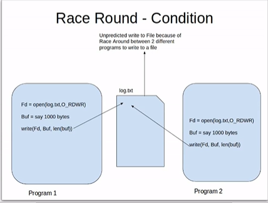

# Advanced FILE IO - Advance file input/output operation
1. RACE condition:
Introducing:
- Linux provides a multi processing environment, this mean there are serveral process running parallelly on linux system.
- Each process base on their priority, the SCHEDULER give every process a definite time on CPU to execute.
=> Hence giving user a virtual feeling that all process are execute at the same time and parallelly.
Concept:
- Race condition is the situaltion that the result produced by two process/threads operating on shared resources in unexpected way on the relative order in which the process gain access to the CPU.

