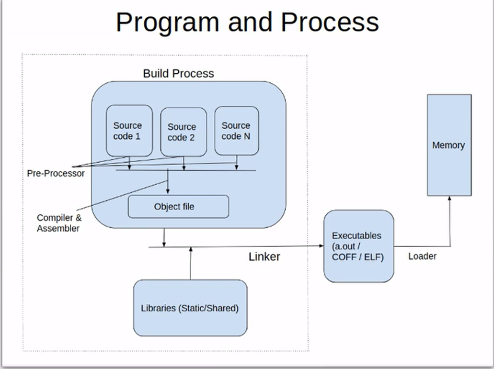

# PROCESS INTRODUCTION
1. Concept:

- Process is an instance of an executing program in memory. The
transformation from a program to a process happens when the program (on disk) is
fetched into memory for execution.
- Program is a human understandable file that containing a range of information 
that describes how to construct process at runtime.
2. Address space:
- With multiple processes contending and executing simultaneously
(multi-tasking), the operating system must ensure that the memory allocation of
every process is protected from accidental access by another process.
- To address this issue, the kernel provides a level of abstraction between the process
and the physical memory called virtual address space. Virtual address space is the
process' view of memory; it is how the running program views the memory.

=> VIRTUAL MEMORY: Achieved by the kernel's memory manager in coordination with the
CPU's MMU.